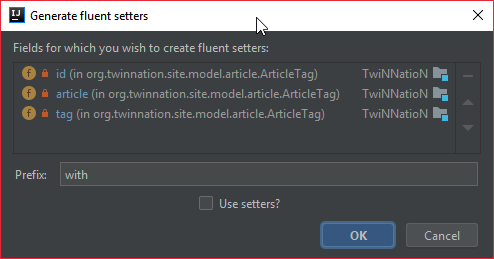

# IntelliJ Fluent Setter Generator

Allows you to generate fluent setters with or without a prefix.

Ironically enough, the code is in Kotlin, but it doesn't support Kotlin (yet).




You can even use the existing setters to set your parameters.


```java
// ...
public ArticleTag withId(Long id) {
	this.id = id;
	return this;
}


public ArticleTag withArticle(Article article) {
	this.article = article;
	return this;
}


public ArticleTag withTag(Tag tag) {
	this.tag = tag;
	return this;
}
// ...
```

```java
new ArticleTag()
    .withId(...)
    .withArticle(...)
    .withTag(...)
```


## TODO

- Kotlin support
    - https://intellij-support.jetbrains.com/hc/en-us/community/posts/115000724850/comments/115000604404
    - https://stackoverflow.com/questions/47439843/make-intellij-idea-plugin-work-with-kotlin-files
    - https://shiraji.github.io/blog/2016/05/14/difference-between-psijavafile-and-ktfile/